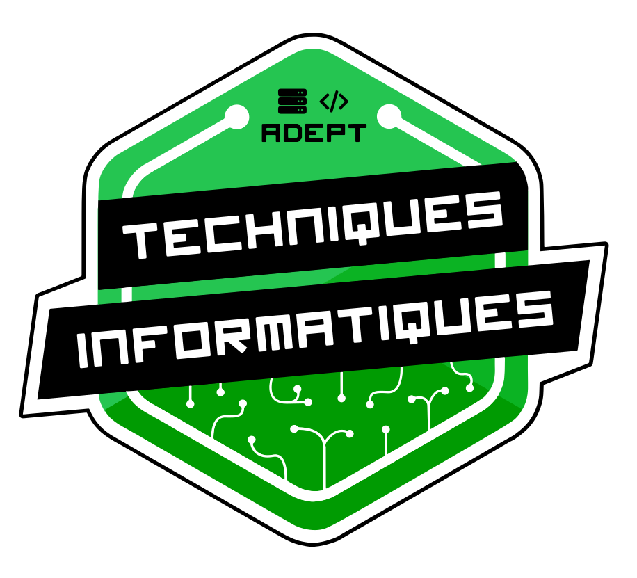

 
# Table des matières
**[Statuts de l'Association](#statuts-de-lassociation)** 
**[Chapitre 1 : Disposition préliminaire](#chapitre1)** 
**[Chapitre 2 : Membres](#chapitre2)** 
**[Chapitre 3 : Assemblée générale](#chapitre3)** 
**[Chapitre 4 : Conseil d'Administration](#chapitre4)** 
**[Chapitre 5 : Délégué(e)](#chapitre5)**  
**[Chapitre 6 : Règlements](#chapitre6)**  
**[Chapitre 7 : Organisation du ménage](#chapitre7)** 
**[Chapitre 8 : Comité officiel du LAN](#chapitre8)** 
**[Chapitre 9 : Présence en ligne](#chapitre9)**
&nbsp;
&nbsp;

# Statuts de l'Association

* Promouvoir, organiser, administrer et défendre les étudiants en informatique vis-à-vis leurs droits et intérêt du point de vue physique, moral, social, intellectuel, économique et pédagogique.
* Favoriser l’esprit de coopération, le travail d'équipe et l'entraide entre chaque étudiant des deux branches de la technique informatique.
* Représenter les étudiants en informatique auprès des instances de l’AGECEM ainsi qu’à l’extérieur du Collège.
*	Informer les étudiants sur les nouveautés informatiques.
*	Organiser des activités liées à l’informatique que ce soit sous forme de divertissement ou informatif.
* Organiser bisannuellement le LAN. (Voir point 1.1.6)
&nbsp;
&nbsp;

# Chapitre 1 : Disposition préliminaire
## 1.	Définition :  
1.  « Assemblée » désigne l’assemblée générale des membres de l’ADEPT Informatique.
2. « Bureau Exécutif » (BE) désigne les membres du Bureau Exécutif de l’AGECEM.
3.	 « ADEPT Informatique » désigne l’association de programme qui est régie par cette charte.
4. « Association » désigne l’ADEPT Informatique
5. « Conseil d’administration » (CA) désigne le conseil d’administration de l’ADEPT Informatique.
6. « Haut Membres de l’ADEPT Informatique » désigne les membres de confiance ainsi que les membres du CA de l’ADEPT. Un ou plusieurs membres du BE peuvent également en faire parti si ceux-ci sont liés à un projet ou à l’ADEPT Informatique elle-même.
7. « LAN » désigne l'événement bisannuel lors duquel l’ADEPT Informatique invite des adeptes de jeux vidéo de partout au Québec à apporter leurs ordinateurs afin de s'amuser ou bien de compétitionner avec leurs compatriotes.
8.  « Membre » désigne toute personne membre de l’ADEPT Informatique.  
    1. « Administrateurs-trices » désigne les membres du conseil d’administration de l’ADEPT Informatique.
    2. « Comité de programme » désigne le comité de programme du département d’informatique du Cégep.  
    3.	« Délégué(e) » désigne toute personne désignée par l’ADEPT Informatique pour la représenter auprès du Cégep, de l’AGECEM ou des comités de programmes.
9. Un « Membre de Confiance » désigne un membre élu par le CA qui a un accès privilégié au local F-045 et qui en assure la supervision lorsqu’aucun membre du CA n’est présent. Seuls ces membres peuvent avoir accès à la clé flottante de l’ADEPT Informatique.

## 2.	Désignation :  
Le présent règlement est désigné sous le nom « Charte de l’ADEPT Informatique ».

## 3.	Abréviation officielle
ADEPT Informatique (Association Des Étudiants et Étudiantes du Programme de Technique) Informatique

## 4.	Siège social
Le siège social de l’ADEPT Informatique est le local F-045.

## 5.	Livres
L’ADEPT Informatique choisit un ou plusieurs livres dans lesquels figurent les documents suivants :

1.  Une copie de sa charte et ses règlements.
2.  Les noms, adresses et coordonnées des administrateurs-trices.
3.  Les résolutions de l’assemblée générale ou du Conseil d’administration.
4.  Les procès-verbaux

## 6.	Emplacement du ou des livres
Le ou les livres de l’ADEPT Informatique doivent être conservés à son siège social.

## 7.	Livre comptable
L’ADEPT Informatique tient à son siège social un livre dans lequel sont inscrits ses recettes et ses débours ainsi que ses transactions financières.

## 8.	Année financière
L’année financière débute le 1ier août et se termine le 30 juin. Elle se divise en deux sessions qui s’étendent du 1ier août au 20 décembre, et du 20 janvier au 30 juin.  
&nbsp;
&nbsp;

# Chapitre 2 : Membres

## 1.  Étudiants membres
Est membre de l’ADEPT Informatique tout étudiant inscrit dans un programme de Technique Informatique du cégep Édouard-Montpetit.

## 2. Droit des membres
  1.  Tous les étudiants membres ont le droit de parole en accord avec la bienséance et les procédures, et ont un droit de vote lors de l’assemblée.
  2.  Seuls les étudiants membres peuvent siéger au conseil d’administration.
  3.  Seuls les étudiants membres peuvent siéger en tant que représentants au comité de programme.
  4.  Seuls les étudiants membres peuvent siéger en tant que Délégué(e).

## 3. Sanctions
Le C.A. de l’ADEPT Informatique se réserve le pouvoir de réprimander ou sanctionner un membre s’il agit à l’encontre des intérêts de cette dernière ou pour raison jugée pertinente par les membres de l’association si la situation le nécessitait.

Une sanction doit être votée à majorité simple (50%+1) du C.A. La personne sanctionnée peut être suspendue, ou être victime de quelques sanctions jugée pertinente et respectueuse. Elle peut convoquer une AG extraordinaire pour une éventuelle levé de sa sanction avant la fin prévue de celle-ci. L’AGECEM doit être avisée de chaque cas de suspension.

Les membres du C.A. doivent, au préalable, donner au membre en faute et à l’assemblée les informations suivantes :

- La ou les fautes reprochées;
- La date et l’endroit où se tiendra la C.A. qui jugera de son cas, afin qu’elle puisse s’y présenter pour se défendre.

Si le membre n’a pu être rejoint et que tout ce qui était possible a été fait pour le rejoindre, la décision sera rendue hors de sa présence.

## 4. Expulsion
Si au terme des deux périodes de suspension le membre fautif n’a toujours pas changé d’attitudes, une Assemblée Extraordinaire peut être convoquée pour discuter de l’expulsion du membre. Le membre doit être présent lors de l’assemblé où son cas est à l’étude. Dans le cas où le membre craint pour sa sécurité physique devant l’assemblée, il peut faire la demande écrite que son cas soit traité en Conseil d’Administration. Dans tous les cas, l’AGECEM doit être avisée du désir d’expulsion avant le début des procédures.

## 5. Membre honoraire
L’ADEPT Informatique peut accorder le statut de membre honoraire à des personnes qui se sont illustrées par leur aide ou par leurs actions au sein de l’ADEPT Informatique. Toutefois, cette gratification ne leur accorde pas le droit de parole et de vote lors des Assemblées. De plus, ces personnes ne peuvent se présenter au Conseil d’administration ou siéger comme Délégué(e).  
&nbsp;
&nbsp;

# Chapitre 3 : Instance

## 1. Généralités
L’Assemblé est l’instance suprême de l’ADEPT Informatique. Ses résolutions sont sans appel.

## 2. Assemblée générale ordinaire biannuelle
L’Assemblée générale ordinaire biannuelle se tient une fois par session. Elle a lieu au plus tard un mois et demi après le début de la session. Le Conseil d’Administration fixe la date et l’heure de l’Assemblée qui doit se tenir pendant la pause commune du mercredi midi. Un avis de convocation ainsi qu’un ordre du jour doivent être diffusés au moins cinq jours ouvrables avant la réunion.

## 3. Assemblée générale extraordinaire
Le Conseil d’Administration ou une pétition ayant amassé des signatures d’au moins dix pour cent des membres de l’ADEPT Informatique et indiquant la raison de la convocation peuvent convoquer une Assemblée extraordinaire. Dans ce cas, l’ordre du jour doit être diffusé au moins un jour ouvrable avant la date de l’Assemblée.

## 4. Quorum
Un minimum de 5% des membres (étudiant en informatique) doit être présent lors de l’Assemblée, en plus des membres du Conseil d’Administration.

## 5.  Rôles et pouvoirs

## L’Assemblée a comme rôles et pouvoirs :
1.	D’adopter le procès-verbal de la séance précédente;
2.	De prendre connaissance des états financiers des Associations de programmes;
3.	D’élire et de destituer les membres du Conseil d’administration;
4.	De recevoir le rapport annuel;
5.	De déterminer les grandes orientations de l’ADEPT Informatique pour la session ou les années à venir;
6.	De discuter de tout sujet qui touche les étudiants en Informatique et de faire les recommandations au Conseil d’administration;
7.	D’appeler une assemblée générale ordinaire ou extraordinaire sur tout sujet qui la concerne.  
&nbsp;
&nbsp;

# Chapitre 4 : Conseil d’Administration
## 1.	Généralité
Le Conseil d’Administration est chargé d’administrer les affaires courantes de l’ADEPT Informatique. Tous membres sortant du C.A. a comme responsabilité de faciliter la transition des tâches de son postes et de former son successeur sur les enjeux et projets touchant son poste.

## 2.	Nombre d’officiers
Le Conseil d’Administration compte au maximum cinq administrateurs.

| Président 	| Officier en chef de l’Association de programme, porte-parole officiel. Préside le Conseil d’administration. Coordonne les différentes instances de l’Association de programme. S’assure que les membres respectent les règles de l’Association de programme et s’occupe de faire appliquer les sanctions. S’assure que chaque tâche des administrateurs soit dûment remplie. 	|
|----------------	|------------------------------------------------------------------------------------------------------------------------------------------------------------------------------------------------------------------------------------------------------------------------------------------------------------------------------------------------------------------------------------------------------------	|
| Vice-président 	| Appuie le président dans son mandat. Agit en tant que président en absence du Président. Agit en tant que mobilisateur lors des instances nécessitant le quorum.S’assure que les membres respectent les règles de l’Association de programme et il s’occupe de faire appliquer les sanctions.S’assurer que chaque tâche des administrateurs soit dûment remplie. 	|
| Secrétaire 	| Responsable des assemblées. Tient à jour les livre. A la garde des archives et les renseignements de l’ADEPT Informatique. Le secrétaire a aussi la responsabilité de veiller à ce que les règles de l’association soient respectées à l’intérieur du local ainsi que sur les plateformes en ligne associées à l’ADEPT informatique. |
| Trésorerie 	| Tient à jour les livres de comptabilité. Prépare les bilans et les budgets à présenter à l’AGECEM. Présente les demandes de subventions. 	|
| Externe 	| Participe en tant que représentant au comité de programme. S’occupe de garder le contact avec les autres organismes. Il s’occupe des relations publiques de l’ADEPT Informatique. Par exemple informer les nouveaux membres de l’existence de l’ADEPT Informatique. |

## 3. Durée du mandat
La durée du mandat d’un officier est d’une session. Il débute au début de la session qui suit l’Assemblée général ordinaire d’élection de la session en cours et se termine à la fin de la session suivant l’Assemble générale ordinaire d’élection.

## 4. Élections
L’élection des officiers se fait en Assemblée ordinaire de chaque session. La mise en candidature se fait par proposition avec appui. Qu’il y ait un ou plusieurs candidats pour chaque poste, les électeurs ont toujours la possibilité de refuser les candidats en votant pour la «Chaise».

## 5. Réunion
Lorsque le premier Conseil d’administration est nommé lors de l’Assemblée générale bisannuelle, une première réunion du Conseil doit se tenir dans les plus brefs délais après le début de la nouvelle session,  préférablement afin de débuter les préparatifs du LAN le plus rapidement possible. La fréquence de ces réunions sera déterminée selon les besoins. Chaque point d’ordre discuté lors de réunion sera catégorisé entre privé et public, si le point est jugé privé, le conseil gardera ce point privé et seulement accessible aux administrateurs-trices (aucune raison particulière n'est nécessaire pour considérer une réunion comme privée). Tous les membres pourront avoir accès aux points jugés publics à condition que l'espace le permette.

## 6. Clefs
Les membres du Conseil d’Administration et les membres de confiance sont les seuls membres pouvant être en possession d'une clef du local de l’Association.  
&nbsp;
&nbsp;
 
# Chapitre 5 : Délégué(e)
## 1.	Mode d’élection au Conseil étudiant
Les délégué(e)s sont choisis par le Conseil d’Administration parmi les membres du Conseil d’administration et les membres de confiance en début de session. Deux délégué(e)s seront choisis par le Conseil d’administration pour siéger au Conseil Étudiants.Cependant, au moins un des représentants devra être choisi parmi les membres du CA pour représenter l’ADEPT Informatique au Conseil.

## 2.	Démission
Un membre du C.A. peut démissionner en tout temps. Cela n’est pas lié au fait de quitter l’association, quitter le seul poste est possible. Dans les deux cas, une lettre (ou un e-mail) aux autres membres du C.A. afin d’expliquer sa démission est requise. La démission prend effet immédiatement et est communiquée au reste des membres avec - ou non - la raison de la démission.

Le membre sortant doit toutefois pouvoir être contacté pour des questions ou des conseils quant à la gestion de son poste.
&nbsp;
&nbsp;

## 3. Destitution
Tout membre du C.A. peut être destitué de ses fonctions. Toutefois, la destitution doit se faire par vote d’une A.G. extraordinaire et le ou les membres concernés ne peuvent occuper le poste de Président d’assemblée ni de Secrétaire d’assemblée.

Le ou les membres concernés doivent entendre la raison de leurs destitution et ont le droit de se défendre. Après délibération c’est aux membres de l’association présents à l’A.G. de décider par vote à majorité simple (ou vote secret si la situation le nécessitait).

 
# Chapitre 6 : Règlements

## RAPPEL: Les règlements de l’AGECEM sont prioritaires sur ceux du présent document. Quelques exceptions sont possibles prenant compte que nous sommes une association de programme informatique.

## RAPPEL 2 : Toute personne qui s’exprime dans le local de l’ADEPT ou dans un groupe de discussion public lié à l’association, ainsi que toute personne arborant un article qui l’identifie à l’ADEPT Informatique se doit de s’abstenir de tout propos homophobe, sexiste ou de nature discriminatoire. Dans l’éventualité où un membre enfreindrait ce règlement, ce dernier seras automatiquement suspendu de l'ADEPT, et ce, de manière temporaire ou permanente selon le jugement des membres du conseil d’administration.

## 1.	Chaque membre de l’ADEPT Informatique ainsi que les visiteurs acceptent la présente charte au moment même où ils entrent dans le local de l’Association ou à l'achat d'un bien les faisant représenter cette dernière.

## 2.	Chaque membre et chaque visiteur doivent respecter ses pairs de l’Association et nous entendons par respect, aucun geste physique ou parole ne risquant de blesser l’un de nos membres

## 3.	L’ordinateur et l'accès à internet sont destinés en priorité à un usage académique, principalement aux travaux d'équipes afin de ne pas déranger les locaux.

> **3.1** Un usage déplacé, nuisant ou déplaisant pour tout utilisateur des ordinateurs ou de l’accès à internet peut mener à une interdiction d’utiliser ceux-ci à l’ADEPT Informatique.

## 4.	Il est la responsabilité de chacun de veiller à la propreté du local. Une personne qui nuit à la propreté du local se verra sanctionnée.

## 5.	Il est interdit de sortir un accessoire appartenant à l’ADEPT Informatique sans le consentement du Conseil d’Administration.

## 6.	En cas de bris de matériel ayant une valeur de moins de 25$, le responsable du bris est tenu de remplacer ou de payer la valeur de ce dernier, sous peine de suspension. Dans le cas où la valeur du bien brisé est supérieure à 25$ et que le bris est volontaire, la suspension est automatique et un dédommagement est attendu de la part du responsable. Dans le cas de non-paiement, des poursuites judiciaires pourront s’en suivre.

## 7.	Endommager le mobilier peut-être passible de suspension et de dédommagement monétaire.

## 8.	L’ADEPT Informatique n’est pas responsable des bris ou des vols d’objet personnel, sauf sur la demande de contrat de garantie écrit avec le CA, avec l’accord de 50%+1 des membres du CA.

## 9.	Tout vol de matériel est jugé comme une suspension automatique et des poursuites judiciaires peuvent s’en suivre.

## 10.	Le non-respect des présents règlements peut résulter d’une expulsion temporaire ou définitive du local de l’Association.

## 11.	Le local de l’ADEPT Informatique est restreint à ses membres, aux personnes voulant bénéficier de ses services (autofinancement ou soutient technique), aux membres du conseil d’administration des autres organismes étudiants de l’AGECEM et au bureau exécutif de l’AGECEM.  
&nbsp;
&nbsp;
 
# Chapitre 7 : Organisation du ménage

## 1.	Fonctionnement
  1. Tous les membres de l’ADEPT Informatique sont liés par contrat à la présente charte, par conséquent ils doivent s’impliquer.
  2. Chaque membre doit faire le ménage de ses propres déchets
  3. Chaque membre doit s’implique dans le «Gros Ménage». Ce gros ménage est prévu chaque semaine, plus un jour. Par exemple, la semaine un, le jour du «Gros Ménage» est le lundi, alors la semaine deux ce sera le mardi, etc.

# Chapitre 8 : Comité officiel du LAN
Le comité officiel du LAN est un comité formé de membres volontaires qui s'engagent à l'organisation du LAN. Ce comité est établi à chaque début de session. Il est composé de 4 rôles officiels et d'équipe sous-jacente à chacun des rôles.

L'objectif de ce comité est d'alléger la charge de travail des administrateurs par rapport à l'organisation du LAN bisannuel. Il permet aussi d'officialiser les équipes dès le début de session et donc de commencer l’organisation de l'événement le plus tôt possible.

| Rôle | Description |
|---|---|
| Gestionnaire de LAN | Chef du comité, il coordonne, avec le CA, les préparatifs du LAN et veille au bon déroulement de l'organisation au sein des différentes équipes.  Bien qu'il n'ait pas le droit de vote, il participe aux rencontres du conseil d'administration et fait des propositions aux administrateurs sur les points en rapport au LAN.  |
| Responsable réseau | Il est le chef de *l'équipe réseau*. Il supervise et coordonne avec le gestionnaire de LAN les tâches liées à la préparation de l'infrastructure réseau du LAN. C'est aussi lui qui doit assurer un suivi avec la DISTi pour les points relatifs à la connexion internet du LAN.  |
| Délégué au matériel et aux locaux | Il est le responsable de l'installation du matériel et des locaux à l'exception de ce qui a trait au réseau. Il assure donc la location et le retour d'équipement ainsi que la réservation de locaux et d'air climatisé pour l'événement. Il supervise l'installation du matériel le jour du LAN (table, électricité, vérifie l'air climatisé, etc. ) et le rangement du matériel le lendemain. Finalement, le délégué, s'occupe de *l'équipe d'installation du LAN* qui l'assiste dans ses tâches et l'aide à l'installation et au rangement du matériel.  |
| Responsable des tournois | Il est responsable de *l'équipe des administrateurs de tournois* et de promouvoir la participation aux tournois organisés. Il doit donc recruter des membres pour administrer des tournois, superviser l'organisation des différents tournois et faire la promotion des tournois auprès des membres inscrits au LAN. |

### Élection des membres du comité
Le **Gestionnaire de LAN** est le seul membre du comité élu par l'Assemblée générale. Il est élu en même temps que les membres du Conseil d'Administration.

Par la suite c'est le **Gestionnaire de LAN** et le Conseil d'Administration qui choisissent ensemble le **Responsable réseau**, le **Délégué au matériel et aux locaux** et le **Responsable des tournois** parmi les volontaires au début de chaque session.  

Enfin chacun des membres élus pourra composer leur propre équipe selon leur bon vouloir. Le **Responsable réseau** nomme donc les membres de *l'équipe réseau*, le **Responsable des tournois** établi *l'équipe d'administrateurs de tournois* et le **Délégué au matériel et aux locaux** nomme *l'équipe d'installation du LAN*, toujours parmi les membres volontaires.

**En se présentant comme volontaire, tous les membres du comité s’engagent à se présenter et à participer activement à l'installation et au rangement du matériel durant le LAN avec *l'équipe d'installation***.

# Chapitre 9 : Présence en ligne de l'ADEPT
L'usage des services en ligne officiels de l'ADEPT ainsi que tout contenu publié sur un ou plusieurs de ces services sont soummis aux règlements énoncés dans la présente charte. Tout utilisateur qui ne respecte pas ces règlements pourra se voir interdit d'accès à ces services.

Par "*services en ligne officiels de l'ADEPT*", nous désignons les comptes et services qui sont la propriété de l'ADEPT Informatique, c'est à dire :

- [Le site web de l'association](http://adeptinfo.ca/)
- [La page Facebook de l'association](https://www.facebook.com/ADEPTInformatique/)
- [Le serveur Discord officiel de l'ADEPT](https://discordapp.com/invite/5hcyQfx)
- [L'organisation ADEPT-Informatique sur GitHub](https://github.com/adept-informatique)
- [Le compte Twitch de l'ADEPT Informatique](https://www.twitch.tv/adeptinformatique)
- [Le compte Instagram de l'ADEPT Informatique](https://www.instagram.com/adept_informatique/)
